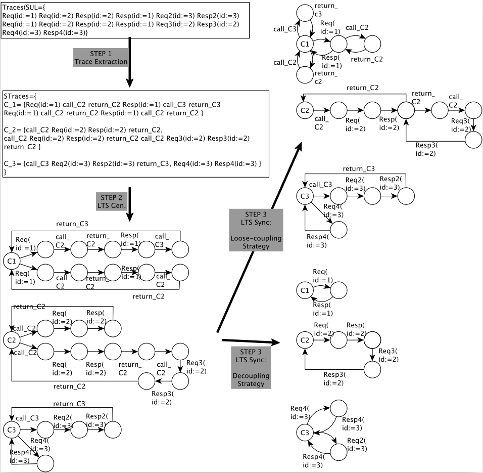

# ASSESS
This is the implementation of the ASSESS method, used for preliminary tests.

## Method

ASSESS is a passive model learning method for IoT device, that infers a system of LTSs (Labelled Transition Systems) from execution traces. 
Each LTS of the system will represent a different component of the device, according to two different strategies: Loose-coupling that keep dependency between the components, and Decoupled where we consider that the components are all independent.
The method takes formatted traces as input (you can use the TFormat tool to help you format the traces: https://github.com/Elblot/TFormat), with at least one parameter that represents an Identifier of the component that produced it, and generate the model in three steps:

-Traces Extraction: in this step, we separate events in traces that have different identifiers, and are due to different components.
Then we put in the same set of traces, the traces that contains events with the same identifiers.

-LTS Generation : For each set of traces, we create an LTS, were each event of a trace is represented by an edge.
As most of the IoT device are cyclic, the final states are merged with the initial one.

-LTS synchronization : The LTS are modified in function of the chosen strategy, then reduced with the help of kTail.




## Contents

**ASSESS/src/** contains the implementation of the ASSESS method.

**ASSESS/traces** contains an example of good formatted traces.

**ASSESS/RESULTS** The folder that will contains the results, **ASSESS/RESULTS/weak** contain the result of the run on the traces of **ASSESS/traces** with the Loose-coupling strategy.

## Usage

After compilation, with <ASSESS.jar> your runnable jar:
```
java -jar <ASSESS.jar> -d <input> -a <strategy> -o <output>
```
\<input\> : the folder that contains all your input trace.

\<strategy\> : "weak" for loosely-coupling strategy, and "strong" for decoupled strategy.
  
Results are generated in the **ASSESS/\<output\>** folder.

Other options: 

-t   shows the duration of each step of the program.

-w   show temporal files used.


### Change the identifier parameters

Currently, the parameters considered like identifier are "Host" and "Dest", if you want to change them, you need to change them directly in the code in  **ASSESS/src/Correlation.java** and **ASSESS/src/Group.java**.

## TODO

- [ ] change the name of the strategies options.

- [ ] put the Identifier parameter in an option.
